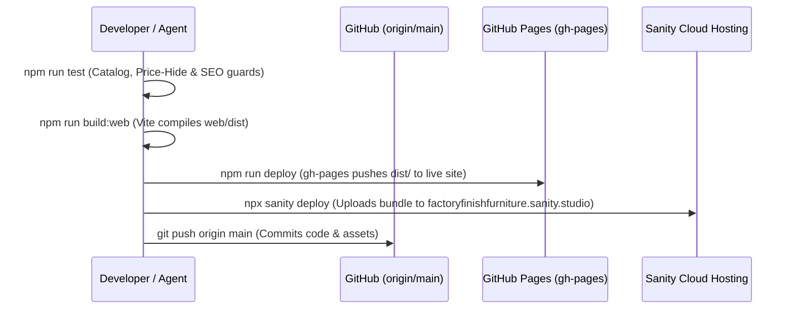

# 01. Architecture & Technology Stack

This document details the software architecture, repository organization, dependency boundaries, and deployment pipelines powering Factory Finish Furniture.

---

## 1. Monorepo Organization

The project is structured as an npm workspaces monorepo under `/Users/homemac/Work/factory-finish-furniture`:

```text
factory-finish-furniture/
├── docs/                      # Centralized documentation and knowledge base
├── scripts/                   # Operational & data pipeline automation scripts
│   └── upload-all-images-to-sanity.cjs  # Batch uploader for CDN assets
├── studio/                    # Sanity Studio v6 (Headless CMS application)
│   ├── .sanity/               # Auto-generated studio build cache & runtimes
│   ├── schemaTypes/           # Content type definitions (product, blogPost, siteSettings)
│   ├── sanity.config.ts       # Studio workspace setup, project ID & plugins
│   ├── sanity.cli.ts          # CLI deployment configuration & App ID
│   ├── package.json           # Studio dependencies (Sanity v6, React 19)
│   └── tsconfig.json          # TypeScript compilation settings
├── web/                       # Public storefront & blog system
│   ├── blog/                  # Pre-rendered SEO design guide HTML pages
│   ├── public/                # Static assets, sitemap.xml, robots.txt, images
│   │   └── images/products/   # Local copies of authentic workshop photographs
│   ├── src/
│   │   ├── components/        # React UI components (Hero, Navbar, Catalog, Modals)
│   │   ├── data/              # Default authentic catalog fallback (products.json)
│   │   ├── utils/             # Sanity client, WhatsApp generator, SEO schemas
│   │   ├── App.jsx            # Core application root
│   │   └── main.jsx           # React DOM hydration entry point
│   ├── package.json           # Storefront dependencies (React 19, Vite 6, Tailwind)
│   └── vite.config.js         # Build tooling & multi-page HTML inputs
├── package.json               # Root monorepo workspace orchestrator
└── sanity-products.ndjson     # Seed dataset for Sanity Content Lake
```

---

## 2. Technology Stack Breakdown

| Subsystem | Framework / Library | Version | Rationale |
| :--- | :--- | :--- | :--- |
| **Frontend Framework** | React | `^19.3.0` | Modern component architecture, concurrent rendering, lightweight runtime |
| **Build Tooling** | Vite | `^6.1.0` | Instant HMR, sub-second production bundling, native ESM support |
| **Styling** | Tailwind CSS | `^3.4.17` | Utility-first, responsive design, dark architectural luxury theme |
| **Icons** | Lucide React | `^0.475.0` | Crisp SVG iconography for dimensions, warranty badges, and navigation |
| **Headless CMS** | Sanity Studio | `^6.16.0` | Real-time editing, Portable Text, visual media hotspot cropping |
| **Data Fetching** | `@sanity/client` | `^7.27.0` | GROQ query execution with edge CDN caching |
| **Image CDN** | `@sanity/image-url`| `^1.2.0` | Dynamic WebP/AVIF transformation, thumbnail generation, responsive sizes |
| **Hosting (Storefront)**| GitHub Pages | Managed | Zero maintenance, global CDN distribution, free custom domain SSL |
| **Hosting (Studio)** | Sanity Cloud Hosting | Managed | Dedicated SSL subdomain (`factoryfinishfurniture.sanity.studio`) |

---

## 3. Dependency Harmonization (React 19)

A key architectural milestone was synchronizing dependencies to **React 19** across both workspaces (`web` and `studio`):

* **The Problem:** In npm workspace monorepos, running mixed major versions (e.g. React 18 in `web` and React 19 in `studio`) causes npm hoisting conflicts. Packages like `styled-components` in the root tree pick up the wrong React dispatcher, throwing `TypeError: Cannot read properties of null (reading 'useContext')` during static manifest extraction.
* **The Solution:** Both `web/package.json` and `studio/package.json` explicitly require `react: "^19.3.0"` and `react-dom: "^19.3.0"`. This ensures 100% clean builds, instantaneous Studio manifest compilation (700ms), and zero runtime context collisions.

---

## 4. Domain & DNS Configuration

The public site is mapped to the custom apex domain **`factoryfinishfurniture.com`**:

### DNS Records
* **A Records (Apex `@`):**
  * `185.199.108.153`
  * `185.199.109.153`
  * `185.199.110.153`
  * `185.199.111.153`
* **CNAME Record (`www`):**
  * Points to: `deepak7mahto.github.io`
* **CNAME File:**
  * Located at `web/public/CNAME` (contains `factoryfinishfurniture.com`).
  * Copied automatically into `dist/` during every Vite build to ensure GitHub Pages never drops the custom domain binding.
* **SSL Certificate:**
  * Auto-provisioned by Let's Encrypt through GitHub Pages with HTTP/2 and forced HTTPS redirect enabled.

---

## 5. Build & Deployment Lifecycle



1. **Test Verification (`npm run test`):** Executes 3 automated test suites verifying catalog integrity (all 28 listings), price-hidden URL formatting, and SEO/Schema.org structures.
2. **Web Production Build (`npm run build:web`):** Compiles Vite React components and all 5 pre-rendered static blog HTML files.
3. **Web Deployment (`npm run deploy`):** Pushes the static bundle to the `gh-pages` branch using the `gh-pages` npm package.
4. **Studio Deployment (`npm run build:studio` / `sanity deploy`):** Compiles Sanity Studio v6, generates Manifest v3, and deploys to `https://factoryfinishfurniture.sanity.studio`.
