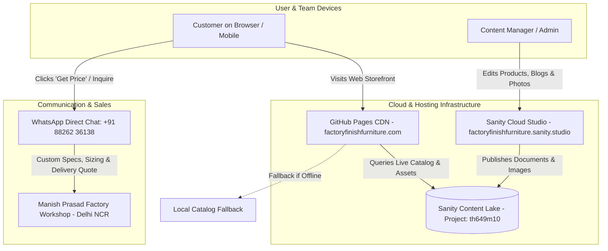

# Factory Finish Furniture — Knowledge Base & Documentation Portal

Welcome to the centralized documentation and technical repository for **Factory Finish Furniture** (`factoryfinishfurniture.com`). This documentation details the architectural decisions, business logic, content management processes, data pipelines, and operational playbooks gathered during development.

---

## 📚 Table of Contents

| Document | Focus & Summary | Key Topics |
| :--- | :--- | :--- |
| **[01. Architecture & Stack](01-architecture-and-stack.md)** | System overview & monorepo design | React 19, Vite 6, Sanity Studio v6, GitHub Pages, CDN, CNAME |
| **[02. Business Rules & Brand](02-business-rules-and-brand.md)** | Commercial identity & conversion logic | Manish Prasad, Delhi workshop, Price-Hidden architecture, WhatsApp quotes |
| **[03. Catalog Specifications](03-catalog-specifications.md)** | Product taxonomy & craftsmanship specs | 28 authentic designs, HDMR, PU Polish, Toughened Glass, 5-Yr Warranty |
| **[04. Sanity CMS Guide](04-sanity-cms-guide.md)** | Headless CMS configuration & dashboard | Studio v6, Content Agent, Schemas, App ID linking, Multi-user roles |
| **[05. Data Pipelines & Assets](05-data-pipelines-and-assets.md)** | Media assets, seeding & GROQ queries | 69 authentic photos, automated uploader, asset fallback resilience |
| **[06. SEO & Marketing Strategy](06-seo-and-content-strategy.md)** | Discoverability, local SEO & blog hub | Schema.org JSON-LD, 5 pre-rendered design guides, sitemap.xml |
| **[07. Operational Playbook](07-developer-playbook.md)** | Maintenance, commands & troubleshooting | Development scripts, test suites, deployments, error resolution |

---

## 🌐 Quick Reference: Live Environments

* **Public Web Storefront:** [https://factoryfinishfurniture.com](https://factoryfinishfurniture.com)
* **Sanity Studio (Cloud CMS):** [https://factoryfinishfurniture.sanity.studio](https://factoryfinishfurniture.sanity.studio)
* **Sanity Organization Portal:** [https://www.sanity.io/@ozg7kfdfp/studio/i4yxt5c9smjht6q4v2vwmy73](https://www.sanity.io/@ozg7kfdfp/studio/i4yxt5c9smjht6q4v2vwmy73)
* **Lead Workshop Contact / WhatsApp:** `+91 88262 36138`
* **GitHub Repository:** `https://github.com/deepak7mahto/factory-finish-furniture`

---

## 🏗️ High-Level System Architecture

---

## ⚡ Key Architectural Tenets

1. **Zero Recurring Infrastructure Costs:**
   * Hosting is 100% free via GitHub Pages (custom apex domain with automated Let's Encrypt SSL).
   * CMS hosting is 100% free via Sanity.io cloud hosting and managed Content Lake.
2. **Quote-on-WhatsApp Conversion Model:**
   * No fixed numeric prices are displayed publicly to prevent price shopping and ensure bespoke consultations tailored to custom room sizes, materials, and delivery pins.
3. **Resilient Data Architecture:**
   * The website dynamically fetches from Sanity Content Lake. If Sanity is ever unreachable or an asset is pending, it seamlessly falls back to bundled static assets with zero disruption to buyers.
4. **Strict Authenticity:**
   * Only the 28 unique designs manufactured at Manish Prasad's Delhi facility are featured, eliminating duplicates and stock photography.
